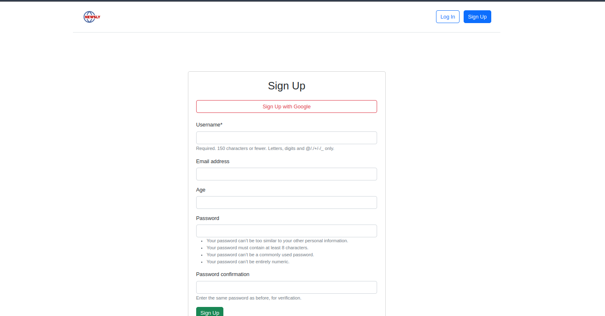
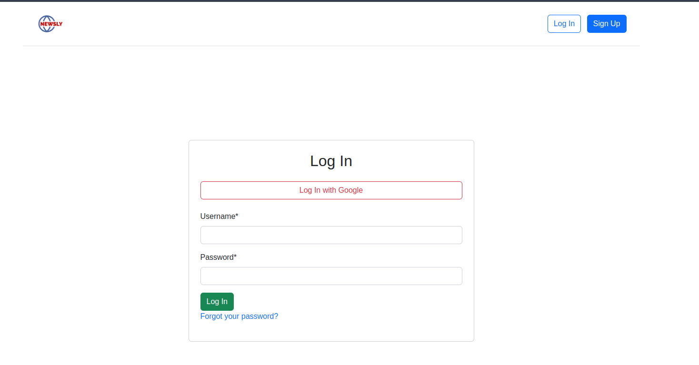

<div align="center">
<h1>Newsly-Django- A full-featured newspaper application  </div>
</div>


<!-- TABLE OF CONTENTS -->
<details>
  <summary>Table of Contents</summary>
  <ol>
    <li>
      <a href="#about-the-project">About The Project</a>
    </li>
    <li>
      <a href="#Features">Features</a>
    </li>
    <li>
      <a href="#Technologies">Technologies Used</a>
    </li>
    <li>
      <a href="#installation">Installation</a>
    </li>
    <li><a href="#contact">Contact</a></li>    
    
  </ol>
  
</details>

## About The Project
A full-featured newspaper application developed with Django and Bootstrap, providing tools for publishing, editing, and managing news articles. The application is designed to offer a seamless experience with user authentication, and dynamic content management.

**Sing-Up:** 
**Login:** 


### Features
- **User Authentication**
  - Secure user login and registration.
  - Social login with Google.

- **Article Management**
  - Publish, edit, and delete articles.
  - Rich text support for article content.

- **Comment System**
  - Add comments on articles.
  - Interact with other users' comments.

- **Dynamic Home Page**
  - Showcases the latest articles.
  - Features trending and highlighted news.

- **Responsive Design**
  - Mobile-friendly layout using Bootstrap 5.

### Technologies Used
- **Backend:**
  - Python with Django framework
  - SQLite or any other database (PostgreSQL/MySQL)

- **Frontend:**
  - Bootstrap 5 for responsive design
  - Custom CSS for additional styling

- **Authentication:**
  - Django's built-in authentication system
  - Google OAuth integration with django-allauth

### Installation

Installing and setting up this app.


1. Clone the repo
   ```sh
   https://github.com/asiq-dev/Newsly-Django.git
   ```
2. Create a virtual environment for this project
   ```sh
   python -m venv venv (linux)
   ```

3. Activated virtual environment
   ```sh
   source venv/bin/activate (linux)
   venv\Scripts\activate (Windows)
   ```

4. Install requirements files for this project
   ```sh
   pip install -r requirements.txt
   ```

5. Make a copy of local_settings.example to local_settings.py and put your info.(For send email, forgot password, reset password, sign-in, sign-up with google)
   ```sh
   local_setting.example to local_settings.py
   ```

6. We are done! let's run the server
   ```sh
   python manage.py runserver
   ```

## Contact

Asiqul Islam - ashiq.cse.mail@gmail.com

<p align="right">(<a href="#readme-top">back to top</a>)</p>

